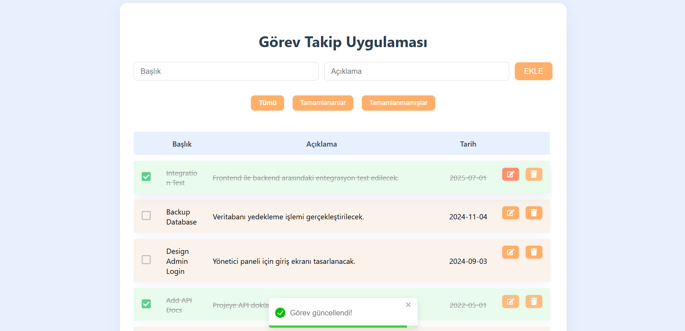

# Task Tracking Application

A specialized React application designed for employees to efficiently track and manage daily workplace tasks. This project focuses on a clean user interface and functional state management for task lifecycles.

## Key Features
- **Task Management:** Create, edit, and delete tasks with ease.
- **Visual Status Tracking:** Mark tasks as completed with distinct visual separation.
- **Advanced Filtering:** Filter tasks by status: All, Completed, or Pending.
- **Responsive Design:** Fully optimized for both mobile and desktop environments.

## Installation & Setup
1. **Clone the repository:**
   ```bash
   git clone [https://github.com/akifpsh/gorev-takip.git](https://github.com/akifpsh/gorev-takip.git)
   cd gorev-takip

2. Install dependencies:
  npm install

3. Start the application:
  npm start

4. Access the app:
  Open http://localhost:3000 in your browser.

5. Screenshots  
  

This project is licensed under the MIT License.
